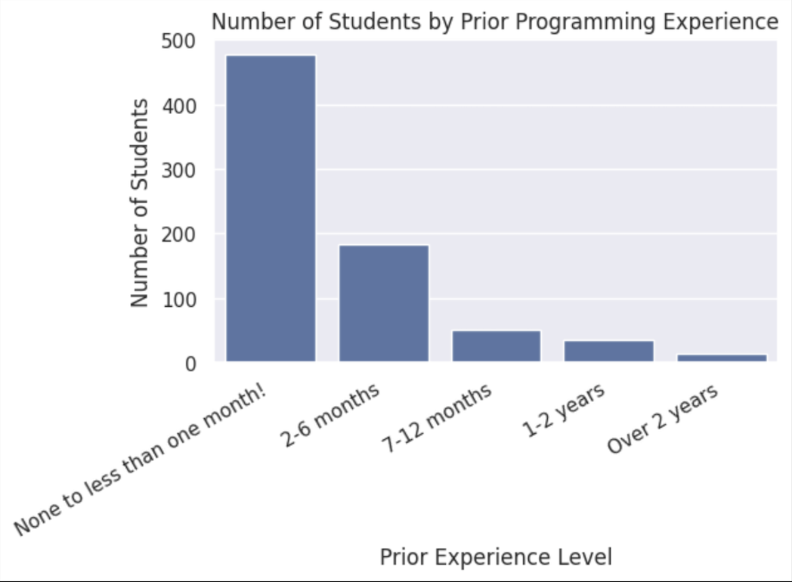
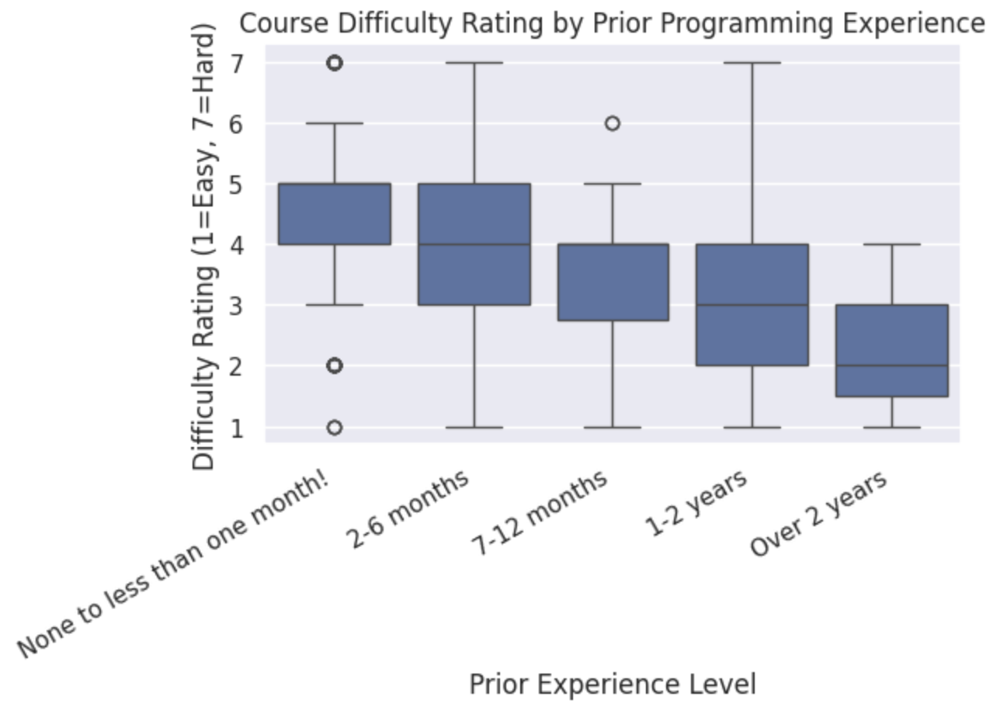
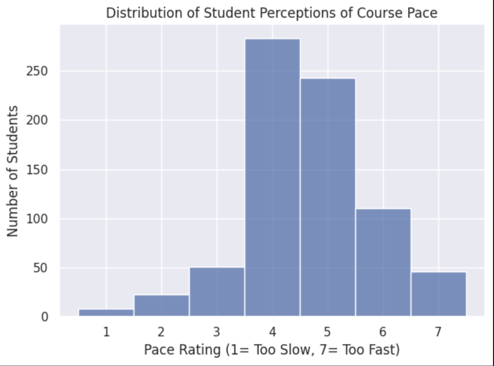

# COMP 110 Continuous Improvement Analysis

**Author:** Sophya  
**Course:** COMP 110 - Spring 2026  
**Project:** EX09 - Data Analysis for Continuous Improvement

---

## Project Overview

This project analyzes anonymized survey data from COMP 110 students to investigate whether **periodic anonymous pace and difficulty check-ins** would create meaningful value for students and instructors throughout the semester. Using utility functions I built (`head`, `select`, `concat`, `count`) along with a custom helper function, I explored the relationship between students' prior programming experience, their perception of course difficulty, and their experience of course pace.

---

## Summary of Analysis

The analysis combines two anonymized COMP 110 survey datasets (764 total student responses) and explores three key questions:

1. **What is the distribution of prior programming experience among COMP 110 students?**
2. **Do students with less prior experience find the course more difficult than experienced peers?**
3. **How do students collectively perceive the pace of the course?**

I produced three visualizations using the `seaborn` library to investigate these questions: a bar chart of student counts by experience level, a boxplot comparing difficulty ratings across experience groups, and a histogram of pace perceptions across the entire student body.

---

## Visualizations

### Chart 1: Distribution of Prior Programming Experience

This bar chart reveals that **approximately 63% of COMP 110 students enter the course with less than one month of prior programming experience**. Of 764 students surveyed, 478 reported "None to less than one month" of experience, while only 50 students (6.5%) reported more than one year of experience. This dramatic skew toward beginners provides important context for any proposed course modifications.

### Chart 2: Course Difficulty Rating by Prior Experience Level

This boxplot compares the distribution of difficulty ratings (1 = Very Easy, 7 = Very Difficult) across the five prior experience groups. Students with less than one month of experience tend to report higher median difficulty ratings, while students with over a year of experience generally report lower difficulty ratings. This pattern suggests that prior programming experience meaningfully shapes how students experience the course's difficulty.

### Chart 3: Student Perceptions of Course Pace

This histogram shows the distribution of student responses on the pace scale (1 = Very Slowly, 7 = Very Quickly). The data reveals that **more than half of students rate the course pace at 5 or higher**, indicating they perceive the course as moving "slightly fast" to "very fast." Only a small minority (about 4%) rated the pace at 1 or 2. This widespread perception of fast pacing supports the value of ongoing pace check-ins.

---

## Conclusion

The analysis broadly supports my proposed idea of implementing **periodic anonymous pace and difficulty check-ins** throughout the semester. The data shows that COMP 110 is composed largely of beginner programmers, that students with less experience generally rate the course as more difficult, and that the course pace is widely perceived as fast. Together, these findings suggest that students may benefit significantly from a structured, low-cost feedback channel that allows instructors to identify when groups of students are silently falling behind.

### Recommendation

Implement brief, anonymous check-ins administered every 2-3 weeks throughout the semester. Each check-in could include three short Likert-scale questions (current pace perception, current difficulty perception, and overall confidence) and one optional free-response question.

### Trade-offs

This proposal does come with potential downsides. Frequent surveys risk creating "survey fatigue," adjusting pace mid-semester could disadvantage students already keeping up, and instructors would need additional time to review responses. Additionally, the analysis correlates prior experience with difficulty perception but does not prove causation.

### Future Work

Future iterations could include a pilot study testing different check-in frequencies, additional survey questions about whether students considered dropping the course, and integration with optional peer study group